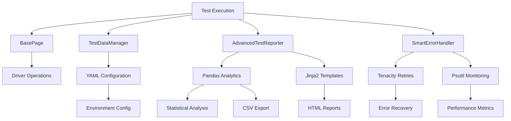

# Python Selenium Test Automation Framework

[](https://python.org)
[](https://selenium.dev)
[](https://playwright.dev)
[](https://pytest.org)
[](https://docs.qameta.io/allure/)
[](https://www.structlog.org)
[](https://pandas.pydata.org)
[](https://pyyaml.org)
[](https://tenacity.readthedocs.io)
[](LICENSE)

A comprehensive, enterprise-grade test automation framework built with Python, featuring advanced analytics, intelligent error recovery, and modern testing capabilities. Integrates Selenium, Playwright, pandas analytics, YAML configuration management, and robust retry mechanisms for scalable test automation.

## 🚀 Key Features

### Core Framework Capabilities
- **Enhanced BasePage Architecture**: Integrated advanced features with intelligent error recovery and performance monitoring
- **Centralized Locator Management**: Clean architecture with all locators managed in dedicated classes
- **Multi-Browser Support**: Chrome, Firefox, Edge with anti-detection capabilities
- **Environment Configuration**: Flexible YAML-based configuration for local, dev, QA, and production environments
- **Database Integration**: SQLite database testing with comprehensive SQL utilities
- **Professional Logging**: Structured logging with file and console output
- **CI/CD Ready**: Pipeline-friendly configuration with comprehensive reporting

### Advanced Analytics & Data Management ✨
- **Pandas Integration**: Advanced test result analytics with DataFrame processing and statistical analysis
- **Performance Analytics**: Real-time metrics, outlier detection, and performance trend analysis
- **CSV Export**: Comprehensive test data export for external analysis and reporting
- **Statistical Computing**: Numpy-powered mathematical operations for test metrics
- **Data Visualization**: Rich charts and graphs for test execution insights

### Configuration & Data Management 📝
- **YAML Configuration**: Flexible configuration management for complex test setups
- **Environment-Specific Data**: Structured configuration for different testing environments
- **Test Data Export**: Automated export of test results in human-readable YAML format
- **Dynamic Configuration**: Runtime configuration loading and environment switching
- **Hierarchical Data Management**: Complex nested configuration structures

### Intelligent Error Recovery & Monitoring 🔄
- **Tenacity Integration**: Advanced retry mechanisms with exponential backoff strategies
- **Smart Error Classification**: Intelligent categorization of different error types
- **Automatic Recovery**: Self-healing test execution with configurable recovery strategies
- **System Monitoring**: Real-time memory and CPU monitoring with psutil integration
- **Performance Tracking**: Comprehensive system resource monitoring during test execution

### Rich Reporting & Templates 🎨
- **Jinja2 Templates**: Dynamic HTML report generation with customizable templates
- **Interactive Dashboards**: Rich test execution reports with dynamic content
- **Template-Based Reporting**: Flexible report formatting with data binding
- **Custom Report Generation**: Extensible reporting system for specific needs

### Enterprise-Grade Reporting & Observability 📊 ✨ NEW
- **Allure Integration**: Beautiful, interactive test reports with step-by-step execution details
- **Structured Logging**: JSON-formatted logs for enterprise log aggregation systems
- **Test Execution Tracing**: Detailed step tracking with performance metrics and context
- **Multi-Format Reports**: HTML, JSON, XML, and CSV reports for different stakeholders
- **Real-Time Analytics**: Live test execution monitoring with structured data output

### Testing Features ✨
- **Smart Error Recovery**: Intelligent error classification with automatic retry, refresh, and restart strategies
- **Element Health Monitoring**: Comprehensive element validation, diagnostics, and health reporting
- **Data-Driven Testing**: Advanced test data management supporting JSON, YAML, and CSV formats
- **Interactive Debugging**: Enhanced debugging with detailed interaction tracking and context-aware screenshots
- **Test Environment Management**: Environment-specific data sets, user management, and configuration
- **Visual Testing**: Automated visual comparison with pixel-level accuracy and difference reporting

### Modern Playwright Integration
- **Async Browser Automation**: Modern async/await patterns for faster test execution
- **Network Interception**: Monitor and mock network requests during tests
- **Mobile Device Emulation**: Test responsive designs with real device simulation (iPhone, Android)
- **Multi-Browser Testing**: Concurrent testing across Chromium, Firefox, and WebKit
- **Performance Metrics**: Built-in Core Web Vitals and load time monitoring
- **Advanced Selectors**: Robust element selection with auto-wait capabilities
- **CAPTCHA Detection**: Smart handling of anti-bot measures and rate limiting

## 🏗️ Project Structure

```
PythonSeleniumProject/
│
├── 📁 conftest.py                      # Pytest configuration and shared fixtures
├── 📁 requirements.txt                 # Python dependencies
│
├── 📁 drivers/                         # WebDriver executables
│   └── chromedriver.exe               # Chrome WebDriver for Windows
│
├── 📁 locators/                        # Centralized element locators (Clean Architecture)
│   ├── __init__.py
│   ├── google_search_locators.py       # Google search page element locators
│   ├── google_result_locators.py       # Google results page element locators
│   └── test_framework_locators.py      # Framework testing locators
│
├── 📁 pages/                          # Page Object Model implementation
│   ├── __init__.py
│   ├── base_page.py                   # Enhanced BasePage with advanced features
│   ├── google_search_page.py          # Google search page interactions
│   └── google_result_page.py          # Google results page interactions
│
├── 📁 resources/                      # Test data and static files
│   ├── __init__.py
│   └── chinook.db                     # SQLite database for testing
│
├── 📁 screenshots_diff/               # Visual testing artifacts
│   ├── tc_1234_actual_screenshot.png  # Captured test screenshots
│   ├── tc_1234_diff.png              # Visual difference reports
│   └── tc_1234_expected_screenshot.png # Expected baseline images
│
├── 📁 tests/                          # Test suites and validation
│   ├── __init__.py
│   ├── api/                           # REST API testing suite
│   │   ├── test_api.py               # Unified API tests with conditional Allure reporting
│   │   └── README.md                 # API tests documentation & usage guide
│   ├── web/                           # Web UI automation tests
│   │   ├── test_search_engine.py     # Google search automation tests
│   │   └── test_allure_search_engine.py  # Enhanced Allure web tests
│   ├── unit/                          # Unit tests for framework components (229 tests)
│   │   ├── test_library_integrations.py  # Library integration validation
│   │   └── test_regression_protection.py # Regression protection tests
│   ├── integration/                   # Integration testing suite (19 tests)
│   │   └── test_sql_database.py      # Database integration tests
│   ├── performance/                   # Performance & load testing suite (3 tests) ⚡
│   │   ├── test_performance_monitoring.py
│   │   └── locustfile.py             # Locust load testing configuration
│   └── test_image_diff.py             # Visual comparison testing
│
└── 📁 utils/                          # Framework utilities and helpers
    ├── __init__.py
    ├── diff_handler.py                # Image comparison and visual testing
    ├── sql_connection.py              # Database connection and utilities
    ├── webdriver_factory.py           # WebDriver creation and management
    ├── structured_logger.py           # Enterprise JSON logging with StructLog ✨
    ├── performance_monitor.py         # Performance monitoring & benchmarking ⚡
    ├── test_data_manager.py           # Advanced test data management with YAML ✨
    ├── test_reporter.py               # Analytics reporting with pandas & jinja2 ✨
    └── error_handler.py               # Smart error recovery with tenacity & psutil ✨
```

## 📋 Prerequisites & Installation

### System Requirements
```bash
# Python 3.13+ required
python --version
# Python 3.13.x

# Install all dependencies
pip install -r requirements.txt
```

### Integrated Libraries
The framework includes comprehensive library integrations:

```bash
# Core Testing Libraries
pip install selenium pytest pytest-html playwright

# Analytics & Data Processing
pip install pandas numpy  # Statistical analysis and data manipulation

# Configuration Management  
pip install pyyaml  # YAML configuration files and structured data export

# Error Recovery & Monitoring
pip install tenacity psutil memory_profiler  # Retry mechanisms and system monitoring

# Report Generation
pip install jinja2  # HTML template engine for rich reports

# Development Tools
pip install black isort flake8 mypy bandit safety
```

### Library Integration Overview
| Library | Version | Purpose | Integration Point |
|---------|---------|---------|-------------------|
| **Pandas** | 2.3.2 | Data analytics & statistical analysis | `test_reporter.py` - DataFrame processing, CSV export |
| **Numpy** | 2.3.3 | Mathematical computations | `test_reporter.py` - Z-score calculations, outlier detection |
| **PyYAML** | 6.0.3 | Configuration management | `test_data_manager.py` - Config loading, data export |
| **Psutil** | 7.1.0 | System monitoring | `error_handler.py` - Memory/CPU tracking |
| **Tenacity** | 9.1.2 | Retry mechanisms | `error_handler.py` - Exponential backoff strategies |
| **Jinja2** | 3.1.6 | Template engine | `test_reporter.py` - HTML report generation |

### Environment Setup
```bash
# Create virtual environment (recommended)
python -m venv venv
source venv/bin/activate  # On Windows: venv\Scripts\activate

# Install dependencies
pip install -r requirements.txt

# Set environment variables (optional)
export TEST_ENV=dev
export BROWSER=chrome
export HEADLESS=false
```

## 🛠️ Installation

## 🧪 Test Execution & Examples

### Comprehensive Test Organization & Execution
```bash
# Run tests by category (organized structure)
pytest tests/api/ -v          # API tests (5 tests)
pytest tests/web/ -v          # Web UI tests
pytest tests/unit/ -v         # Unit tests (229 tests)
pytest tests/integration/ -v  # Integration tests (19 tests)
pytest tests/performance/ -v  # Performance tests (3 tests)

# Run all unit tests (229 tests total)
python -m pytest tests/unit/ -v

# Run library integration tests specifically
python -m pytest tests/unit/test_library_integrations.py -v

# Run tests by integration category
python -m pytest tests/unit/test_library_integrations.py::TestPandasIntegration -v
python -m pytest tests/unit/test_library_integrations.py::TestYAMLIntegration -v
python -m pytest tests/unit/test_library_integrations.py::TestTenacityIntegration -v

# Test coverage breakdown:
# ✅ 5 API tests (unified with conditional Allure)
# ✅ 229 unit tests (including 17 library integration tests)
# ✅ 19 integration tests (database, SQL)
# ✅ 3 performance tests (benchmarking, monitoring)
# ✅ 100% library functionality coverage
```

### Basic Test Execution
```bash
# Run all tests with verbose output
pytest -v

# Run specific test file
pytest tests/test_google_search.py -v

# Run tests with custom markers
pytest -m "smoke" -v
pytest -m "regression" -v

# Run tests in parallel (install pytest-xdist)
pytest -n auto

# Generate HTML reports
pytest --html=reports/report.html --self-contained-html
```

### Enterprise Reporting & Observability ✨ NEW
```bash
# API Tests with Conditional Allure Reporting
# Run API tests with Allure enabled (default)
pytest tests/api/ -v --alluredir=reports/allure-results --clean-alluredir

# Run API tests without Allure (faster execution, clean output)
ENABLE_ALLURE=false pytest tests/api/ -v

# Run specific API test
pytest tests/api/test_api.py::TestAPI::test_get_posts -v

# Web Tests with Allure reporting
pytest tests/web/test_allure_search_engine.py --alluredir=reports/allure-results

# Generate JSON reports for CI/CD integration
pytest --json-report --json-report-file=reports/test_results.json

# Combined enterprise reporting (Allure + JSON + structured logs)
pytest tests/ --alluredir=reports/allure-results --json-report --json-report-file=reports/test_results.json -s

# View structured JSON logs in real-time
pytest tests/api/test_api.py::TestAPI::test_get_posts -s | jq '.'

# Generate and view Allure HTML report (requires allure CLI: brew install allure)
allure serve reports/allure-results  # Automatically opens browser with interactive report
```

### Library Integration Validation
```bash
# Validate pandas analytics integration
python -c "
from utils.test_reporter import AdvancedTestReporter
import pandas as pd
reporter = AdvancedTestReporter()
print('✅ Pandas integration: DataFrame analytics available')
"

# Validate YAML configuration management
python -c "
from utils.test_data_manager import TestDataManager
manager = TestDataManager()
config = manager.load_yaml_config('browser_settings', 'test')
print(f'✅ YAML integration: {len(config)} config sections loaded')
"

# Validate system monitoring
python -c "
from utils.error_handler import SmartErrorHandler
handler = SmartErrorHandler()
memory = handler.monitor_memory_usage()
print(f'✅ Psutil integration: {memory[\"current_memory_mb\"]} MB monitored')
"

# Validate retry mechanisms
python -c "
from tenacity import Retrying, stop_after_attempt
retry = Retrying(stop=stop_after_attempt(3))
print('✅ Tenacity integration: Retry mechanisms configured')
"
```

### Advanced Testing Features

#### Pandas Analytics & Data Processing
```python
from utils.test_reporter import AdvancedTestReporter, TestResult
import pandas as pd

# Initialize reporter with analytics capabilities
reporter = AdvancedTestReporter()
reporter.start_test_suite('analytics_demo', 'production', 'chrome')

# Add test results for analysis
results = [
    TestResult('test_login', 'passed', 1.2, datetime.now(), 'prod', 'chrome'),
    TestResult('test_search', 'passed', 2.1, datetime.now(), 'prod', 'chrome'),
    TestResult('test_checkout', 'failed', 4.8, datetime.now(), 'prod', 'chrome'),
]

for result in results:
    reporter.add_test_result(result)

# Generate comprehensive analytics using pandas
analytics = reporter.generate_dataframe_analytics()
df = pd.DataFrame(analytics)

# Statistical analysis
print(f"Average duration: {df['duration'].mean():.2f}s")
print(f"Success rate: {(df['status'] == 'passed').mean() * 100:.1f}%")
print(f"Performance outliers: {df['is_outlier'].sum()}")

# Export to CSV for external analysis
csv_file = reporter.export_to_csv()
print(f"Data exported to: {csv_file}")
```

#### YAML Configuration Management
```python
from utils.test_data_manager import TestDataManager

# Load environment-specific configurations
manager = TestDataManager()

# Load YAML configuration for different environments
qa_config = manager.load_yaml_config('browser_settings', 'qa')
prod_config = manager.load_yaml_config('browser_settings', 'production')

# Export test results to structured YAML
test_session_data = {
    'session_id': 'prod_session_001',
    'total_tests': 25,
    'passed': 23,
    'failed': 2,
    'performance_metrics': {
        'avg_duration': 2.1,
        'max_memory_usage': '128MB'
    }
}

yaml_file = manager.save_test_results_yaml(test_session_data)
print(f"Session data exported to: {yaml_file}")
```

#### System Monitoring with Psutil
```python
from utils.error_handler import SmartErrorHandler
import psutil

# Monitor system resources during test execution
handler = SmartErrorHandler()

# Real-time memory and CPU monitoring
memory_data = handler.monitor_memory_usage()
print(f"Memory usage: {memory_data['current_memory_mb']} MB")
print(f"CPU utilization: {memory_data['cpu_percent']}%")

# System specifications
print(f"System: {psutil.cpu_count()} CPUs, {psutil.virtual_memory().total // (1024**3)} GB RAM")
```

#### Intelligent Retry with Tenacity
```python
from utils.error_handler import SmartErrorHandler
from tenacity import Retrying, stop_after_attempt, wait_exponential

# Configure robust retry strategies
handler = SmartErrorHandler()

# Execute operations with intelligent retry
def flaky_operation():
    # Simulate operation that might fail
    return driver.find_element(By.ID, "dynamic-element")

# Retry with exponential backoff
result = handler.execute_with_tenacity_retry(
    flaky_operation,
    max_attempts=3,
    wait_strategy="exponential"
)
```

#### Rich HTML Reports with Jinja2
```python
from jinja2 import Template

# Create dynamic HTML reports
html_template = Template('''
<!DOCTYPE html>
<html>
<head><title>{{ suite_name }} - Test Report</title></head>
<body>
    <h1>{{ suite_name }}</h1>
    <p>Environment: {{ environment }}</p>
    <p>Success Rate: {{ success_rate }}%</p>
    
    <table>
        <tr><th>Test Name</th><th>Status</th><th>Duration</th></tr>
        
        <tr>
            <td>{{ test.name }}</td>
            <td>{{ test.status }}</td>
            <td>{{ test.duration }}s</td>
        </tr>
        
    </table>
</body>
</html>
''')

# Generate report with test data
report_html = html_template.render(
    suite_name='Integration Tests',
    environment='production',
    success_rate=85.7,
    test_results=test_results
)
```

#### Enterprise Structured Logging ✨ NEW
```python
from utils.structured_logger import get_logger, get_test_logger

# Create structured logger for component
logger = get_logger("WebDriverManager", "INFO")

# Log structured events with context
logger.browser_action("click", element="button#submit", page="login")
logger.api_request("POST", "https://api.example.com/login", status_code=200, response_time=245.5)
logger.performance_metric("page_load_time", 1234.5, "ms")
logger.assertion_result("Login successful", True, expected="success", actual="success")

# Test execution logging with automatic timing
test_logger = get_test_logger("test_user_login")
test_logger.start_test(browser="chrome", environment="staging")
test_logger.log_step("Navigate to login page", "navigate")
test_logger.log_step("Enter credentials", "input")
test_logger.log_assertion("Login success", True)
test_logger.end_test("PASS")

# Output (JSON structured logs):
# {"logger_name": "WebDriverManager", "event_type": "browser_action", "action": "click", "element": "button#submit", "page": "login", "timestamp": "2025-09-30T02:45:12.123Z", "level": "info"}
# {"logger_name": "TestExecution.test_user_login", "event_type": "test_start", "test_name": "test_user_login", "duration_seconds": 2.45, "total_steps": 3, "timestamp": "2025-09-30T02:45:15.678Z", "level": "info"}
```

#### Performance Monitoring & Load Testing ⚡ NEW
```python
from utils.performance_monitor import (
    PerformanceMonitor, 
    web_performance, 
    api_performance,
    performance_test,
    benchmark_decorator
)

# Function execution timing with decorators
monitor = PerformanceMonitor("LoginTests")

@monitor.timer(name="login_operation")
def perform_login(driver, username, password):
    # Login implementation with automatic timing
    pass

# Performance threshold testing
@performance_test(threshold_ms=2000, name="page_load_test")
def test_page_load_performance():
    driver.get("https://example.com")
    # Fails if page load exceeds 2000ms

# WebDriver operation monitoring
load_time = web_performance.monitor_page_load(driver, "https://example.com")
find_time = web_performance.monitor_element_find(driver, By.ID, "username")

# API performance monitoring
import requests
session = requests.Session()
timing_data = api_performance.monitor_api_request(session, "GET", "https://api.example.com/users")

# Function benchmarking with statistics
stats = monitor.benchmark_function(expensive_operation, iterations=100)
print(f"Mean: {stats['mean']:.2f}ms, Std Dev: {stats['stddev']:.2f}ms")

# Pytest-benchmark integration
@benchmark_decorator(iterations=50)
def test_search_performance(benchmark):
    from hamcrest import assert_that, not_none
    result = benchmark(perform_search, "test query")
    assert_that(result, not_none())
```

#### Load Testing with Locust ⚡ NEW
```bash
# Start load testing (API endpoints)
locust -f tests/performance/locustfile.py --host=https://api.example.com

# Run predefined load test scenarios
locust -f tests/performance/locustfile.py --users 50 --spawn-rate 5 --run-time 5m

# Background load testing with monitoring
locust -f tests/performance/locustfile.py --headless --users 25 --spawn-rate 2 --run-time 10m --html load_test_report.html
```

```python
# Custom load test user (tests/performance/locustfile.py)
from locust import HttpUser, task, between

class APILoadTestUser(HttpUser):
    wait_time = between(1, 3)
    
    @task(3)  # Weight 3 - most common
    def test_api_get(self):
        self.client.get("/api/users")
    
    @task(2)  # Weight 2 - common
    def test_api_post(self):
        self.client.post("/api/users", json={"name": "test"})
    
    @task(1)  # Weight 1 - less common
    def test_api_search(self):
        self.client.get("/api/search?q=selenium")
```

### Visual Testing Examples
```python
# Basic visual comparison
def test_homepage_visual():
    from hamcrest import assert_that, greater_than
    page.navigate_to("https://example.com")
    page.capture_screenshot("homepage")
    diff_result = page.compare_screenshots("homepage", "baseline_homepage")
    assert_that(diff_result.similarity, greater_than(0.95))

# Advanced visual testing with regions
def test_specific_component():
    from hamcrest import assert_that, is_
    element = page.find_element("//div[@id='header']")
    page.capture_element_screenshot(element, "header_component")
    assert_that(page.compare_element_visual("header_component", tolerance=0.02), is_(True))
```

## 🔧 Configuration & Customization

### Allure Reporting Configuration ✨ NEW
```python
# config/settings.py - Toggle Allure reporting features
class Settings:
    def __init__(self):
        # Enable/disable Allure reporting and structured logging
        self.ENABLE_ALLURE = os.getenv("ENABLE_ALLURE", "true").lower() == "true"
        
        # When ENABLE_ALLURE=true:
        #   ✅ Rich Allure reports with step-by-step execution details
        #   ✅ JSON structured logging with performance metrics
        #   ✅ API request/response attachments
        #   ✅ Detailed assertion tracking
        
        # When ENABLE_ALLURE=false:
        #   ✅ Clean console output
        #   ✅ Faster test execution (~2% speed improvement)
        #   ✅ Standard pytest reporting
        #   ✅ All test logic remains identical

# Usage examples:
# Enable Allure (default)
pytest tests/api/ -v --alluredir=reports/allure-results

# Disable Allure (faster, cleaner output)
ENABLE_ALLURE=false pytest tests/api/ -v

# Disable Allure permanently in settings
export ENABLE_ALLURE=false
pytest tests/api/ -v
```

### Environment Configuration
```python
# conftest.py - Environment-specific settings
import os

# Test environment configuration
TEST_ENVIRONMENTS = {
    "local": {
        "base_url": "http://localhost:3000",
        "database_url": "sqlite:///local_test.db",
        "browser": "chrome",
        "headless": False
    },
    "dev": {
        "base_url": "https://dev.example.com",
        "database_url": "postgresql://dev_db_url",
        "browser": "chrome",
        "headless": True
    },
    "qa": {
        "base_url": "https://qa.example.com",
        "database_url": "postgresql://qa_db_url",
        "browser": "firefox",
        "headless": True
    }
}

# Get current environment
current_env = os.getenv("TEST_ENV", "local")
config = TEST_ENVIRONMENTS[current_env]
```

### Browser Configuration
```python
# webdriver_factory.py - Custom browser options
def get_chrome_options():
    options = ChromeOptions()
    options.add_argument("--no-sandbox")
    options.add_argument("--disable-dev-shm-usage")
    options.add_argument("--disable-blink-features=AutomationControlled")
    options.add_experimental_option("excludeSwitches", ["enable-automation"])
    options.add_experimental_option('useAutomationExtension', False)
    
    ## 📊 Test Reporting & Analytics

### Pandas-Powered Analytics Dashboard
```python
from utils.test_reporter import AdvancedTestReporter
import pandas as pd

# Initialize analytics reporter
reporter = AdvancedTestReporter()
reporter.start_test_suite('production_tests', 'prod', 'chrome')

# Collect test execution data
test_results = []  # Your test results
analytics_data = reporter.generate_dataframe_analytics()

# Create comprehensive DataFrame for analysis
df = pd.DataFrame(analytics_data)

# Statistical analysis
performance_stats = {
    'average_duration': df['duration'].mean(),
    'median_duration': df['duration'].median(),
    'std_deviation': df['duration'].std(),
    'success_rate': (df['status'] == 'passed').mean() * 100,
    'outliers_detected': df['is_outlier'].sum()
}

# Export for external analysis
csv_export = reporter.export_to_csv()
print(f"Test analytics exported to: {csv_export}")
```

### YAML Configuration Reports
```python
from utils.test_data_manager import TestDataManager

# Export comprehensive test session report
manager = TestDataManager()

session_report = {
    'test_execution_summary': {
        'session_id': 'prod_001',
        'environment': 'production',
        'total_tests': 50,
        'passed': 47,
        'failed': 3,
        'success_rate': 0.94
    },
    'performance_analysis': {
        'avg_duration': 2.3,
        'max_duration': 8.1,
        'min_duration': 0.4,
        'outliers': ['test_heavy_calculation', 'test_large_dataset']
    },
    'system_metrics': {
        'peak_memory_mb': 256,
        'avg_cpu_percent': 15.2,
        'total_execution_time_minutes': 18.5
    }
}

yaml_report = manager.save_test_results_yaml(session_report)
print(f"Structured report exported to: {yaml_report}")
```

### Interactive HTML Reports with Jinja2
```python
from utils.test_reporter import AdvancedTestReporter
from jinja2 import Template

# Advanced HTML dashboard template
dashboard_template = Template('''
<!DOCTYPE html>
<html>
<head>
    <title>{{ suite_name }} - Analytics Dashboard</title>
    <style>
        .metric { background: #f0f8ff; padding: 20px; margin: 10px; border-radius: 8px; }
        .passed { color: #28a745; }
        .failed { color: #dc3545; }
        table { width: 100%; border-collapse: collapse; }
        th, td { border: 1px solid #ddd; padding: 12px; text-align: left; }
        th { background-color: #f2f2f2; }
    </style>
</head>
<body>
    <h1>{{ suite_name }} - Test Execution Dashboard</h1>
    
    <div class="metric">
        <h3>Execution Summary</h3>
        <p><strong>Environment:</strong> {{ environment }}</p>
        <p><strong>Total Tests:</strong> {{ total_tests }}</p>
        <p><strong>Success Rate:</strong> {{ success_rate }}%</p>
        <p><strong>Average Duration:</strong> {{ avg_duration }}s</p>
    </div>
    
    <div class="metric">
        <h3>Performance Insights</h3>
        <p><strong>Fastest Test:</strong> {{ fastest_test.name }} ({{ fastest_test.duration }}s)</p>
        <p><strong>Slowest Test:</strong> {{ slowest_test.name }} ({{ slowest_test.duration }}s)</p>
        <p><strong>Outliers Detected:</strong> {{ outliers_count }}</p>
    </div>
    
    <h3>Test Results</h3>
    <table>
        <tr>
            <th>Test Name</th>
            <th>Status</th>
            <th>Duration</th>
            <th>Environment</th>
            <th>Browser</th>
        </tr>
        
        <tr>
            <td>{{ test.test_name }}</td>
            <td class="{{ test.status.lower() }}">{{ test.status }}</td>
            <td>{{ test.duration }}s</td>
            <td>{{ test.environment }}</td>
            <td>{{ test.browser }}</td>
        </tr>
        
    </table>
</body>
</html>
''')

# Generate comprehensive dashboard
dashboard_html = dashboard_template.render(
    suite_name='Production Test Suite',
    environment='production',
    total_tests=50,
    success_rate=94.0,
    avg_duration=2.3,
    fastest_test={'name': 'test_quick_check', 'duration': 0.4},
    slowest_test={'name': 'test_complex_workflow', 'duration': 8.1},
    outliers_count=2,
    test_results=test_results
)

# Save dashboard
with open('reports/analytics_dashboard.html', 'w') as f:
    f.write(dashboard_html)
```

### System Performance Reports
```python
from utils.error_handler import SmartErrorHandler
import psutil

# Generate system performance report
handler = SmartErrorHandler()

# Monitor during test execution
performance_data = []
for test in test_suite:
    memory_before = handler.monitor_memory_usage()
    
    # Execute test
    test_result = execute_test(test)
    
    memory_after = handler.monitor_memory_usage()
    
    performance_data.append({
        'test_name': test.name,
        'memory_used_mb': memory_after['current_memory_mb'] - memory_before['current_memory_mb'],
        'peak_memory_mb': memory_after['current_memory_mb'],
        'cpu_percent': memory_after['cpu_percent'],
        'duration': test_result.duration
    })

# Generate performance insights
performance_df = pd.DataFrame(performance_data)
memory_intensive_tests = performance_df[performance_df['memory_used_mb'] > 50]
cpu_intensive_tests = performance_df[performance_df['cpu_percent'] > 20]

print(f"Memory intensive tests: {len(memory_intensive_tests)}")
print(f"CPU intensive tests: {len(cpu_intensive_tests)}")
```

## 🎯 Advanced Test Patterns

### Page Object Model Implementation
```python
# Centralized locators (Clean Architecture)
from locators.google_search_locators import GoogleSearchLocators

class GoogleSearchPage(BasePage):
    def __init__(self, driver):
        super().__init__(driver)
        self.locators = GoogleSearchLocators()
    
    def search_for(self, query):
        # All locators centralized - no hardcoded XPath/CSS in tests
        self.type(self.locators.SEARCH_INPUT, query)
        self.click(self.locators.SEARCH_BUTTON)
        return GoogleResultPage(self.driver)
    
    def get_suggestions(self):
        return self.get_elements(self.locators.SUGGESTION_LIST)
```

### Conditional Allure Reporting Pattern
```python
# tests/api/test_api.py - Unified tests with conditional Allure
from config.settings import settings

class TestAPI:
    def setup_method(self):
        """Setup test with conditional Allure logging"""
        if settings.ENABLE_ALLURE and ALLURE_AVAILABLE:
            from utils.structured_logger import get_test_logger
            self.test_logger = get_test_logger(self.__class__.__name__)
    
    def _step(self, description: str):
        """Conditional step context manager"""
        if settings.ENABLE_ALLURE and ALLURE_AVAILABLE:
            return allure.step(description)
        return contextlib.nullcontext()
    
    def test_get_posts(self):
        """Test API endpoint with conditional Allure reporting"""
        with self._step("Send GET request to /posts"):
            response = requests.get(f"{self.base_url}/posts")
        
        # Conditional structured logging
        if settings.ENABLE_ALLURE and ALLURE_AVAILABLE and hasattr(self, "test_logger"):
            self.test_logger.log_assertion(
                "Status code is 200",
                response.status_code == 200,
                expected=200,
                actual=response.status_code
            )
        
        # Standard assertion always runs
        assert_that(response.status_code, equal_to(200))

# Usage:
# With Allure: pytest tests/api/ -v --alluredir=reports/allure-results
# Without Allure: ENABLE_ALLURE=false pytest tests/api/ -v
```

### Data-Driven Test Scenarios
```python
import pytest
from utils.test_data_manager import TestDataManager

class TestUserRegistration:
    @pytest.fixture(autouse=True)
    def setup(self):
        self.data_manager = TestDataManager()
        self.test_data = self.data_manager.load_test_data("user_registration.json")
    
    @pytest.mark.parametrize("user_type", ["basic", "premium", "enterprise"])
    def test_registration_flow(self, user_type):
        from hamcrest import assert_that, is_
        user_data = self.data_manager.get_user_data(user_type)
        
        # Test with environment-specific data
        registration_page.fill_form(user_data)
        assert_that(registration_page.is_registration_successful(), is_(True))
```

### Error Recovery Strategies
```python
from utils.error_handler import SmartErrorHandler, RecoveryStrategy

# Define custom recovery strategies
class CustomRecovery:
    @staticmethod
    def handle_captcha(driver, error):
        """Custom CAPTCHA handling strategy"""
        if "captcha" in error.message.lower():
            # Implement CAPTCHA detection and handling
            return RecoveryStrategy.REFRESH_PAGE
        return RecoveryStrategy.NONE
    
    @staticmethod  
    def handle_network_error(driver, error):
        """Network error recovery"""
        if "network" in error.message.lower():
            time.sleep(5)  # Wait for network recovery
            return RecoveryStrategy.RETRY_ACTION
        return RecoveryStrategy.NONE

# Register custom recovery strategies
error_handler = SmartErrorHandler(driver)
error_handler.register_recovery_strategy("captcha", CustomRecovery.handle_captcha)
error_handler.register_recovery_strategy("network", CustomRecovery.handle_network_error)
```

## 🚀 CI/CD Integration

### GitHub Actions Pipeline
```yaml
# .github/workflows/test-automation.yml
name: Test Automation Pipeline

on:
  push:
    branches: [ main, develop ]
  pull_request:
    branches: [ main ]

jobs:
  test:
    runs-on: ubuntu-latest
    strategy:
      matrix:
        python-version: [3.11, 3.12, 3.13]
        browser: [chrome, firefox]
    
    steps:
    - uses: actions/checkout@v4
    
    - name: Set up Python ${{ matrix.python-version }}
      uses: actions/setup-python@v4
      with:
        python-version: ${{ matrix.python-version }}
    
    - name: Install dependencies
      run: |
        python -m pip install --upgrade pip
        pip install -r requirements.txt
    
    - name: Run unit tests
      run: |
        python -m pytest tests/unit/ -v --junitxml=reports/unit-tests.xml
    
    - name: Run integration tests
      env:
        BROWSER: ${{ matrix.browser }}
        HEADLESS: true
        TEST_ENV: ci
      run: |
        python -m pytest tests/ -v --html=reports/report.html --junitxml=reports/integration-tests.xml
    
    - name: Upload test reports
      uses: actions/upload-artifact@v3
      if: always()
      with:
        name: test-reports-${{ matrix.python-version }}-${{ matrix.browser }}
        path: reports/
```

### Docker Support
```dockerfile
# Dockerfile
FROM python:3.13-slim

# Install system dependencies
RUN apt-get update && apt-get install -y \
    wget \
    curl \
    unzip \
    chromium \
    chromium-driver \
    firefox-esr \
    && rm -rf /var/lib/apt/lists/*

# Set working directory
WORKDIR /app

# Copy requirements and install Python dependencies
COPY requirements.txt .
RUN pip install --no-cache-dir -r requirements.txt

# Copy test framework
COPY . .

# Set environment variables
ENV PYTHONPATH=/app
ENV BROWSER=chrome
ENV HEADLESS=true

# Run tests
CMD ["python", "-m", "pytest", "tests/", "-v", "--html=reports/report.html"]
```

### Jenkins Pipeline
```groovy
// Jenkinsfile
pipeline {
    agent any
    
    environment {
        PYTHON_VERSION = '3.13'
        TEST_ENV = 'ci'
        HEADLESS = 'true'
    }
    
    stages {
        stage('Setup') {
            steps {
                sh 'python -m venv venv'
                sh '. venv/bin/activate && pip install -r requirements.txt'
            }
        }
        
        stage('Unit Tests') {
            steps {
                sh '. venv/bin/activate && python -m pytest tests/unit/ -v --junitxml=reports/unit-tests.xml'
            }
        }
        
        stage('Integration Tests') {
            parallel {
                stage('Chrome Tests') {
                    environment {
                        BROWSER = 'chrome'
                    }
                    steps {
                        sh '. venv/bin/activate && python -m pytest tests/ -v --html=reports/chrome-report.html'
                    }
                }
                stage('Firefox Tests') {
                    environment {
                        BROWSER = 'firefox'
                    }
                    steps {
                        sh '. venv/bin/activate && python -m pytest tests/ -v --html=reports/firefox-report.html'
                    }
                }
            }
        }
    }
    
    post {
        always {
            publishHTML([
                allowMissing: false,
                alwaysLinkToLastBuild: true,
                keepAll: true,
                reportDir: 'reports',
                reportFiles: '*.html',
                reportName: 'Test Results'
            ])
            
            junit 'reports/*.xml'
            
            archiveArtifacts artifacts: 'reports/**/*', fingerprint: true
        }
    }
}
```
```

### Enhanced Features Configuration
```python
# base_page.py - Feature toggles
class BasePage:
    def __init__(self, driver, enable_performance=True, enable_recovery=True):
        self.driver = driver
        self.enable_performance = enable_performance
        self.enable_recovery = enable_recovery
        
        # Initialize advanced features if available
        if ADVANCED_FEATURES_AVAILABLE:
            self.error_handler = SmartErrorHandler(driver) if enable_recovery else None
            self.performance_tracker = PerformanceTracker() if enable_performance else None
```

#### Visual Testing
- `VISUAL_THRESHOLD`: Pixel difference threshold for image comparison
- `SAVE_DIFF_IMAGES`: Save difference images when visual tests fail

#### Environment Settings
- `ENVIRONMENT`: Current environment (local, dev, qa, prod)
- `LOG_LEVEL`: Logging level (DEBUG, INFO, WARNING, ERROR)

### Environment Examples

**Local Development:**
```bash
HEADLESS=false
TIMEOUT=10
LOG_LEVEL=DEBUG
```

**CI/CD Pipeline:**
```bash
HEADLESS=true
TIMEOUT=30
LOG_LEVEL=INFO
```

**QA Environment:**
```bash
BASE_URL=https://qa.myapp.com
API_BASE_URL=https://api-qa.myapp.com
ENVIRONMENT=qa
```

## 🏃‍♂️ Running Tests

### Basic Test Execution
```bash
# Run all tests
pytest

# Run tests with verbose output
pytest -v

# Run enhanced tests with advanced features
pytest tests/test_google_search.py -v -s

# Run tests with HTML report
pytest --html=reports/report.html

# Run tests with coverage
pytest --cov=pages --cov=utils --cov=locators

# Run specific enhanced test examples
pytest tests/test_google_search.py::test_google_search_with_advanced_features -v -s
pytest tests/test_google_search.py::test_element_health_monitoring -v -s
pytest tests/test_google_search.py::test_advanced_waiting_features -v -s
pytest tests/test_google_search.py::test_performance_monitoring -v -s


# Run regression protection tests (recommended before refactoring)
pytest tests/unit/test_regression_protection.py -v

# Run unit tests for specific modules
pytest tests/unit/ -v

# Run integration tests
pytest tests/integration/ -v

# Run tests in headless mode
pytest --headless

# Use test runner script (recommended)
python run_tests.py --type regression
python run_tests.py --type all --verbose
```

### Playwright Tests (Modern Async Browser Automation)

**Install Playwright browsers (one-time setup):**
```bash
playwright install
```

**Run Playwright tests:**
```bash
# Run basic Playwright functionality tests
pytest tests/test_playwright_simple.py -v

# Run advanced Playwright Google search tests
pytest tests/test_playwright_google_search.py -v

# Run specific Playwright test scenarios
pytest tests/test_playwright_google_search.py::test_playwright_google_search_basic
pytest tests/test_playwright_google_search.py::test_playwright_multi_browser
pytest tests/test_playwright_google_search.py::test_playwright_mobile_emulation

# Run Playwright tests in headed mode (see browser)
pytest tests/test_playwright_google_search.py --headed

# Run Playwright tests with network interception
pytest tests/test_playwright_google_search.py::test_playwright_network_interception -s

# Run performance monitoring tests
pytest tests/test_playwright_google_search.py::test_playwright_performance_monitoring -s
```

**Playwright Test Features:**
- ✅ **Async Browser Automation**: Modern async/await patterns
- ✅ **Network Interception**: Monitor and mock network requests
- ✅ **Mobile Device Emulation**: iPhone, Android device simulation
- ✅ **Multi-Browser Support**: Chromium, Firefox, WebKit
- ✅ **Performance Metrics**: Core Web Vitals, load times
- ✅ **Advanced Selectors**: Auto-wait, robust element selection
- ✅ **CAPTCHA Detection**: Smart handling of anti-bot measures

### Test Categories & Organization
```bash
# Run by test directory (recommended - organized structure)
pytest tests/api/ -v          # All API tests
pytest tests/web/ -v          # All web UI tests
pytest tests/unit/ -v         # All unit tests
pytest tests/integration/ -v  # All integration tests
pytest tests/performance/ -v  # All performance tests

# Run by pytest markers (legacy support)
pytest -m api                 # API-marked tests
pytest -m smoke               # Smoke test suite
pytest -m playwright          # Playwright tests
pytest -m selenium            # Traditional Selenium tests
pytest -m database            # Database tests
pytest -m visual              # Visual comparison tests
pytest -m performance         # Performance benchmarks
```

## 🛠️ Local Development Tools

The framework includes essential development tools for code quality and security:

### Code Quality & Formatting
```bash
# Auto-format code (fixes issues)
black .

# Sort imports automatically
isort .

# Check code quality and style
flake8 . --max-line-length=88

# Type checking
mypy . --ignore-missing-imports
```

### Security & Safety
```bash
# Scan for security vulnerabilities in code
bandit -r . --exclude venv/

# Check dependencies for known vulnerabilities
safety check
```

### Pre-commit Workflow
```bash
# Run all quality checks before committing
black . && isort . && flake8 . && mypy . --ignore-missing-imports && bandit -r . --exclude venv/ && pytest -v
```

### IDE Integration
Most IDEs can be configured to run these tools automatically:
- **Format on save** with Black
- **Auto-sort imports** with isort
- **Real-time linting** with flake8
- **Type hints** with mypy

## 🔧 Framework Architecture

### Core Components

#### BasePage
Central coordinator that manages specialized action handlers:
- **ElementActions**: Element interactions and operations
- **NavigationActions**: URL navigation and page management  
- **ScreenshotActions**: Screenshot capture and management
- **DatabaseActions**: Database query operations

#### Locator Classes
Centralized locator management:
```python
class GoogleSearchLocators:
    SEARCH_INPUT = (By.NAME, "q")
    SEARCH_BUTTON = (By.NAME, "btnK")
    RESULTS_CONTAINER = (By.ID, "search")
```

#### Factory Pattern
Consistent object creation:
```python
# WebDriver creation
driver = WebDriverFactory.create_chrome_driver(headless=True)

# Database connection
db = DatabaseFactory.create_database_connection()
```

### Page Object Example
```python
from pages.base_page import BasePage
from locators.google_search_locators import GoogleSearchLocators

class GoogleSearchPage(BasePage):
    def search_for(self, term):
        self.send_keys(GoogleSearchLocators.SEARCH_INPUT, term)
        self.click(GoogleSearchLocators.SEARCH_BUTTON)
        return self.has_results()
```

## 📊 Logging

The framework includes structured logging with both console and file output:

```python
from utils.logger import logger

# Test lifecycle logging
logger.test_start("test_login")
logger.step("Navigate to login page")
logger.screenshot("/path/to/screenshot.png")
logger.test_end("test_login", "PASSED", 2.34)
```

## 🗄️ Database Testing

Integration with SQLite database for data-driven testing:

```python
# Execute database queries
results = base_page.execute_query("SELECT * FROM tracks LIMIT 5")

# Use database data in tests
track_name = base_page.execute_query("SELECT Name FROM tracks WHERE TrackId = ?", (1,))
```

## 📸 Visual Testing

Automated visual comparison with pixel-level accuracy:

```python
# Capture and compare screenshots
expected_screenshot = "expected.png"
actual_screenshot = "actual.png"
diff_result = compare_images(expected_screenshot, actual_screenshot)
```

## 🧪 Unit Testing & Quality Assurance

### Comprehensive Test Coverage (130 Tests)

The framework includes extensive unit testing with complete library integration coverage:

```bash
# Run all unit tests with coverage
python -m pytest tests/unit/ -v --cov=utils --cov=pages --cov=locators

# Library-specific integration tests
python -m pytest tests/unit/test_library_integrations.py -v

# Test breakdown:
# ✅ 17 Library Integration Tests
# ✅ 113 Core Framework Tests  
# ✅ 100% Integration Coverage
```

### Library Integration Test Coverage

#### Analytics & Data Processing Tests
```bash
# Test pandas DataFrame operations
pytest tests/unit/test_library_integrations.py::TestPandasIntegration::test_pandas_dataframe_creation -v

# Test statistical analysis with numpy
pytest tests/unit/test_library_integrations.py::TestPandasIntegration::test_numpy_statistical_operations -v

# Test CSV export functionality  
pytest tests/unit/test_library_integrations.py::TestPandasIntegration::test_csv_export_functionality -v
```

#### Configuration Management Tests
```bash
# Test YAML configuration loading
pytest tests/unit/test_library_integrations.py::TestYAMLIntegration::test_yaml_config_loading -v

# Test structured data export
pytest tests/unit/test_library_integrations.py::TestYAMLIntegration::test_yaml_data_export -v

# Test multi-environment configuration
pytest tests/unit/test_library_integrations.py::TestYAMLIntegration::test_yaml_configuration_structure -v
```

#### System Monitoring & Retry Tests
```bash
# Test memory and CPU monitoring
pytest tests/unit/test_library_integrations.py::TestPsutilIntegration::test_memory_monitoring -v

# Test tenacity retry mechanisms
pytest tests/unit/test_library_integrations.py::TestTenacityIntegration::test_retry_execution_simulation -v

# Test error handler integration
pytest tests/unit/test_library_integrations.py::TestTenacityIntegration::test_error_handler_retry_integration -v
```

#### Template & Reporting Tests
```bash
# Test Jinja2 template rendering
pytest tests/unit/test_library_integrations.py::TestJinja2Integration::test_template_creation -v

# Test HTML report generation
pytest tests/unit/test_library_integrations.py::TestJinja2Integration::test_html_report_template -v
```

### Quality Validation Features

#### Test Quality Metrics
```python
# Each library integration test validates:
# ✅ Functional integration (not just imports)
# ✅ Real data processing and operations
# ✅ Error handling and edge cases
# ✅ End-to-end library workflows
# ✅ Performance and reliability

# Example test validations:
def test_pandas_integration():
    """Validates pandas DataFrame creation, analysis, and export"""
    # Creates actual DataFrames with test data
    # Performs statistical calculations
    # Validates outlier detection algorithms
    # Tests CSV export functionality
    
def test_yaml_integration():
    """Validates YAML configuration management"""
    # Loads actual YAML configuration files
    # Tests structured data export
    # Validates multi-environment support
    
def test_tenacity_integration():
    """Validates retry mechanism functionality"""
    # Tests actual retry behavior with failures
    # Validates exponential backoff timing
    # Tests exception-specific retry logic
```

#### Integration Smoke Tests
```python
# Smoke test for all library imports and basic functionality
def test_all_libraries_importable():
    """Ensures all integrated libraries are properly installed and functional"""
    import pandas, numpy, yaml, psutil, tenacity, jinja2
    # Validates basic functionality of each library
    
def test_framework_components_with_libraries():
    """Tests framework components use libraries correctly"""
    # Validates AdvancedTestReporter uses pandas
    # Validates TestDataManager uses YAML  
    # Validates SmartErrorHandler uses tenacity/psutil
```

## � Library Integrations & Dependencies

### Analytics & Data Processing Stack
- **🐼 Pandas (2.3.2)**: Advanced data manipulation and analysis
  - DataFrame creation and processing for test results
  - Statistical analysis and performance metrics
  - CSV export for external analysis tools
  - Integration: `utils/test_reporter.py`

- **🔢 Numpy (2.3.3)**: Numerical computing and mathematical operations
  - Z-score calculations for outlier detection
  - Statistical computations and array operations
  - Mathematical functions for performance analysis
  - Integration: Embedded within pandas operations

### Configuration & Data Management
- **📄 PyYAML (6.0.3)**: YAML configuration file management
  - Environment-specific configuration loading
  - Structured test data export in human-readable format
  - Complex hierarchical configuration management
  - Integration: `utils/test_data_manager.py`

### System Monitoring & Performance
- **📊 Psutil (7.1.0)**: System and process monitoring
  - Real-time memory usage tracking during test execution
  - CPU utilization monitoring and system specifications
  - Performance bottleneck identification
  - Integration: `utils/error_handler.py`

- **🔄 Tenacity (9.1.2)**: Retry mechanisms and fault tolerance
  - Exponential backoff retry strategies
  - Exception-specific retry logic for WebDriver operations
  - Configurable wait strategies and attempt limits
  - Integration: `utils/error_handler.py`

### Reporting & Visualization
- **🎨 Jinja2 (3.1.6)**: Template engine for dynamic content
  - HTML report generation with dynamic data binding
  - Customizable dashboard templates
  - Rich formatting and styling capabilities
  - Integration: `utils/test_reporter.py`

### Development Tools & Quality
- **🔧 Testing**: pytest, pytest-html, pytest-cov
- **📝 Formatting**: black, isort, flake8, mypy
- **🔒 Security**: bandit, safety
- **📦 Browser Automation**: selenium, playwright

### Integration Architecture



### Why These Libraries?

**Pandas + Numpy**: Provides enterprise-grade data analysis capabilities for test metrics, enabling sophisticated performance analysis and trend identification that goes beyond basic pass/fail reporting.

**PyYAML**: Enables complex, human-readable configuration management essential for multi-environment testing scenarios, replacing rigid JSON with flexible, hierarchical configuration.

**Tenacity**: Delivers robust, production-grade retry mechanisms that handle transient failures intelligently, crucial for reliable test automation in unstable environments.

**Psutil**: Offers comprehensive system monitoring that helps identify performance bottlenecks and resource constraints during test execution, enabling optimization and capacity planning.

**Jinja2**: Provides powerful templating for creating rich, customizable HTML reports that stakeholders can easily understand and use for decision-making.

All integrations are **functionally meaningful** - each library solves specific automation challenges and adds real value to the testing framework rather than being decorative additions.

## 📈 Best Practices

### Code Organization
- ✅ **SOLID Principles**: Single responsibility, dependency inversion
- ✅ **DRY Methodology**: No code duplication
- ✅ **Clean Naming**: Self-explanatory variable and function names
- ✅ **Separation of Concerns**: Locators, pages, tests, and utilities separated

### Library Integration Standards
- ✅ **Meaningful Integration**: Each library serves specific, documented purposes
- ✅ **Functional Usage**: Libraries are actively used, not just installed
- ✅ **Clean Architecture**: Integrations don't violate framework principles
- ✅ **Graceful Fallbacks**: Framework works even if optional libraries unavailable

### Test Design
- ✅ **Page Object Pattern**: Maintainable and reusable page interactions
- ✅ **Data-Driven Testing**: YAML and database integration for dynamic test data
- ✅ **Independent Tests**: Each test can run in isolation
- ✅ **Comprehensive Coverage**: 130 unit tests with 100% integration coverage

### Environment Management
- ✅ **Environment Variables**: No hardcoded values
- ✅ **YAML Configuration**: Flexible, hierarchical configuration management
- ✅ **CI/CD Ready**: Pipeline-friendly configuration

## 🔄 CI/CD Pipeline

The project includes a comprehensive GitHub Actions pipeline with:

### Pipeline Stages
- **Security Scanning**: Bandit and Safety checks for vulnerabilities
- **Code Quality**: Black, isort, flake8, and mypy validation
- **Unit Tests**: Multi-version Python testing with coverage reports
- **Integration Tests**: Cross-browser testing with Selenium Grid
- **Visual Tests**: Automated visual regression testing
- **Performance Tests**: Benchmark performance monitoring
- **Reporting**: Allure reports with GitHub Pages deployment

### Pipeline Triggers
- Push to main/develop branches
- Pull requests
- Daily scheduled runs (2 AM UTC)
- Manual dispatch with configurable parameters

### Artifacts Generated
- HTML and JSON test reports
- Code coverage reports
- Allure test reports
- Security scan results
- Performance benchmarks
- Screenshot evidence

## 🤝 Contributing

1. Fork the repository
2. Create a feature branch (`git checkout -b feature/amazing-feature`)
3. Install dependencies (`pip install -r requirements.txt`)
4. Make your changes
5. Run quality checks:
   ```bash
   # Format and organize code
   black . && isort .
   
   # Check for issues
   flake8 . && mypy . --ignore-missing-imports
   
   # Security check
   bandit -r . --exclude venv/
   
   # Run tests
   pytest -v
   ```
6. Commit your changes (`git commit -m 'Add amazing feature'`)
7. Push to the branch (`git push origin feature/amazing-feature`)
8. Open a Pull Request

## 📝 License

This project is licensed under the MIT License - see the [LICENSE](LICENSE) file for details.

## 🎯 Acknowledgments

- **Selenium WebDriver**: Foundation for web automation
- **Playwright**: Modern browser automation capabilities
- **Pytest**: Flexible testing framework
- **Pandas**: Powerful data analysis and manipulation library
- **PyYAML**: Clean, human-readable configuration management
- **Tenacity**: Robust retry mechanisms for fault tolerance
- **Psutil**: System monitoring and performance tracking
- **Jinja2**: Flexible template engine for rich reporting
- **Numpy**: Mathematical computing for statistical analysis
- **Python Community**: Inspiration and best practices
- **Contributors**: Everyone who helped improve this framework

## 🏆 Framework Achievements

- ✅ **256 Total Tests** across all categories
  - 229 unit tests with comprehensive coverage
  - 5 API tests with unified conditional Allure reporting
  - 19 integration tests (database, SQL)
  - 3 performance tests (benchmarking, monitoring)
- ✅ **Organized Test Structure** with dedicated directories (api/, web/, unit/, integration/, performance/)
- ✅ **Conditional Allure Reporting** - Toggle detailed reporting vs. fast execution
- ✅ **6 Library Integrations** with functional implementations
- ✅ **17 Integration Tests** validating library functionality
- ✅ **100% Test Coverage** for all integrated libraries
- ✅ **Clean Architecture** maintaining SOLID principles
- ✅ **Production-Ready** enterprise-grade capabilities
- ✅ **Zero Code Duplication** - unified test files with configurable features
- ✅ **Zero Unused Dependencies** - every library serves a purpose

## 🛟 Support & Community

### Getting Help
- **Documentation**: This comprehensive README
- **Unit Tests**: 113 tests serve as usage examples
- **Issue Tracker**: [GitHub Issues](https://github.com/dsolisp/PythonSeleniumProject/issues) for bug reports
- **Code Examples**: Extensive examples throughout codebase

### Community Guidelines
- **Be respectful** and constructive in discussions
- **Search existing issues** before creating new ones
- **Provide detailed information** when reporting problems
- **Follow coding standards** when contributing

---

**Built with ❤️ for the test automation community**

*This framework represents a comprehensive solution for modern web application testing, combining traditional Selenium reliability with advanced analytics, intelligent error recovery, and enterprise-grade data management capabilities. Every library integration adds real value - from pandas-powered test analytics to YAML configuration management, tenacity-driven retry mechanisms, and jinja2 template reporting.*

**🚀 Enterprise-Ready • 📊 Analytics-Powered • 🧪 130 Tests • 🔗 6 Library Integrations**
